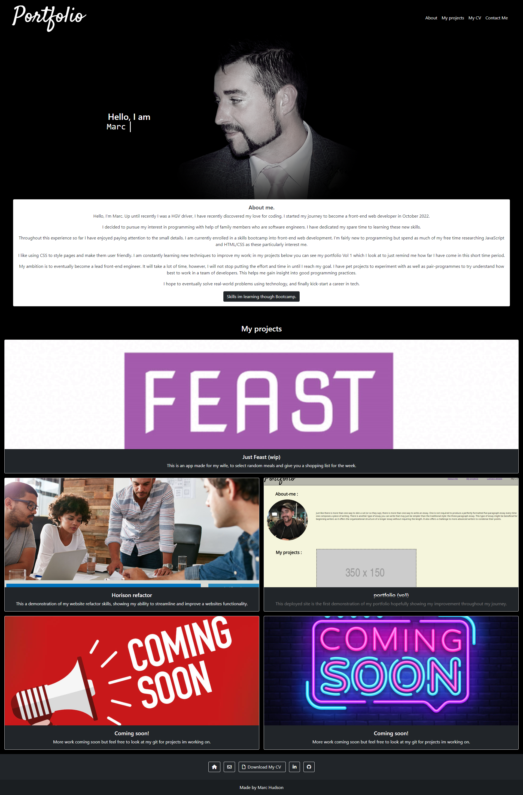

# challenge 3 portfolio with bootstrap.

This is a portfolio built using bootstrap, this showcases my my personal projects and projects i have completed in the bootcamp.
It has a navigation bar, about me section with a button containing what i expect to learn though the boopcamp.
There are links to my personal deployed projects.
In the footer there are links to my github, email, linkedin and my downloadable cv  

## link to deployed application

## screenshot 
